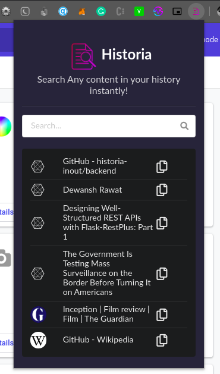
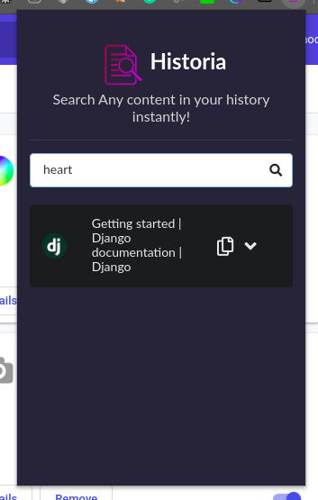

# Welcome to Historia!

Historia is a Chrome Extension which powers users to query through their history with any vague idea that they have about the website and its content. It will even let you search for an image that you have seen somewhere in your past visits using the descriptions that is provided by the user. We have a cross platform Mobile Application which will let the user search through his browser history even in mobile phones.

# Steps to run

## Backend
NOTE : make sure you have Google Cloud Vision API key file exported to path.
* run `git clone https://github.com/historia-inout/backend.git`
*  open the cloned folder in terminal
*  `virtualenv venv`
*  `source venv/bin/activate `
*  `pip install -r requirements `
*  `cd mysite`
*  `python manage.py migrate `
*  `python manage.py runserver`

## Chrome Extension
The Chrome Extension is build using React.
 * run `git clone https://github.com/historia-inout/historia-extension` 
 * open the cloned folder in terminal 
 *  `yarn install`
 *  `yarn run build` 
 * enable developer mode in your extensions page of google chrome
 * load the build folder to install the extension

## Features
* Let users query through their history
* Users can search for any text as well as images(using the description)
* Provides a summary of the website results that the user requests for.

## Screenshots

## Future Work
* Add video content searching functionality
* Provide more privacy to the user by performing everything in the client side.
* Scrape more sites which are now not accessible.

## Contributions
Everyone is open to make any type of contributions to this project. If you find any bugs or need any features to be added you are free to create an issue and if you are able to solve the issue we'll be happy else we will be solving it.
